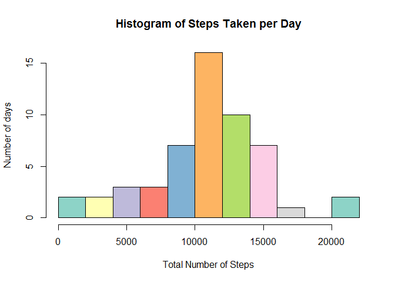
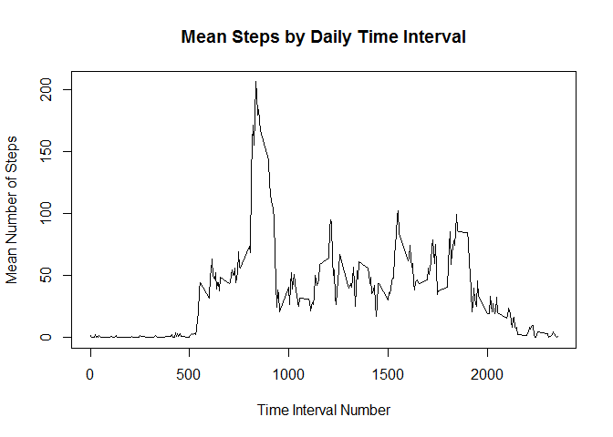
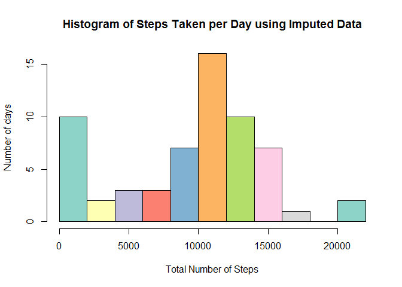
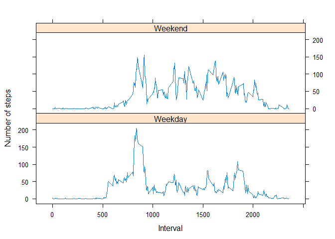

# Reproducible Research: Peer Assessment 1


## Loading and preprocessing the data


```r
library(sqldf)
```

```
## Loading required package: gsubfn
## Loading required package: proto
## Loading required package: RSQLite
## Loading required package: DBI
```

```r
library(dplyr)
```

```
## Warning: package 'dplyr' was built under R version 3.1.3
```

```
## 
## Attaching package: 'dplyr'
## 
## The following object is masked from 'package:stats':
## 
##     filter
## 
## The following objects are masked from 'package:base':
## 
##     intersect, setdiff, setequal, union
```

```r
library(RColorBrewer)
# read the data
# force=TRUE will re-read the input data even if it is in the environment
readData <- function(force=FALSE) {
  if( !exists("steps") | force) { # Don't waste time reading if data in Environment
    steps <<- read.csv(unz("activity.zip","activity.csv"))
  }
}

# prepare a dataset for the histogram taking out the na values
prepareDataSet1 <- function() {
   validData <<- steps[!is.na(steps$steps),]
   histData <<- sqldf("select date,sum(steps) as total_steps from validData group by date")
}

prepareStepsInt <- function()
{
  stepsInt <<- validData %>%
                  group_by(interval) %>%
                    summarize(mean_steps=mean(steps),median_steps=median(steps))
}


preprocess<-function() {
  
  readData() # Read the data
  
  prepareDataSet1() # Prepare the data set for total steps
  prepareStepsInt()
  
}
preprocess()
```

```
## Loading required package: tcltk
```
## What is mean total number of steps taken per day?


```r
meanSteps <- mean(histData$total_steps)
medianSteps <- median(histData$total_steps)

hist(histData$total_steps,main="Histogram of Steps Taken per Day",
     xlab="Total Number of Steps",ylab="Number of days",breaks=10,col=brewer.pal(10,"Set3"))
```

 

- The mean number of steps taken / day 10766.19
- The median number of steps taken / day 10765

## What is the average daily activity pattern?


```r
plot(stepsInt$interval,stepsInt$mean_steps,type='l',
     main="Mean Steps by Daily Time Interval",xlab="Time Interval Number",
     ylab="Mean Number of Steps")
```

 

```r
# Work out the interval with the largest mean

largestMean <- max(stepsInt$mean_steps)
largestInt <- stepsInt$interval[stepsInt$mean_steps == largestMean]
```

- The largest mean is 206.17
- This occurs interval 835

## Imputing missing values


```r
# impute na in the steps column using the median of the interval

imputeData <- inner_join(steps,stepsInt) %>%
                mutate(effective_steps=ifelse(is.na(steps),median_steps,steps),date=as.Date(date),interval)
```

```
## Joining by: "interval"
```

```r
histData2 <- sqldf("select date,sum(effective_steps) as total_steps from imputeData group by date")
hist(histData2$total_steps,main="Histogram of Steps Taken per Day using Imputed Data",
     xlab="Total Number of Steps",ylab="Number of days",breaks=10,col=brewer.pal(10,"Set3"))
```

 

```r
meanSteps <- mean(histData2$total_steps)
medianSteps <- median(histData2$total_steps)
```

- The total number of NA values in the steps column is 2304
- The mean number of steps taken / day 9503.87
- The median number of steps taken / day 10395

The impact of imputing data in this manner is to reduce the mean and median number of steps take per day.

## Are there differences in activity patterns between weekdays and weekends?


```r
library(lattice)

activityData <- imputeData %>%
                   mutate(day_type=as.factor(ifelse(weekdays(date)=='Saturday' | weekdays(date)=='Sunday','Weekend','Weekday')),
                          effective_steps,interval) %>%
                     group_by(day_type,interval) %>%
                       summarize(mean_steps=mean(effective_steps))


xyplot(mean_steps ~ interval|activityData$day_type, 
       data = activityData,
       type = "l",
       xlab = "Interval",
       ylab = "Number of steps",
       layout=c(1,2))
```

 
